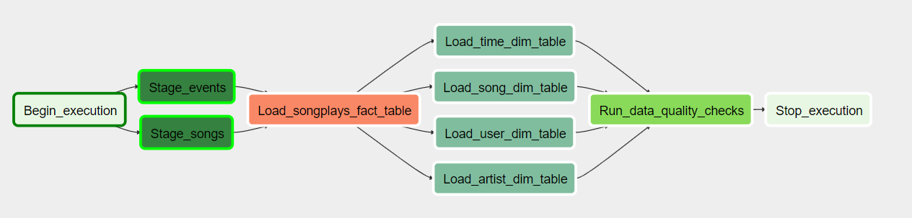

# Airflow_pipeline
This is the Repo of a full Apache Airflow ETL pipline. Data is extracted from raw JSON files residing on AWS S3 and staged in AWS Redshift where data is transformed to a Data Warehouse. The Pipeline is fitted with automatic tests that ensures data quality.

### DAG pipeline and dependencies

## Project structure
This repo contains the following files:
* dags-folder:
  - pipleline.py - The main Airflow DAG for the data pipeline

* plugins-folder
  * operators-folder
    - stage_redshift.py - Airflow custom operator to read JSON files from S3 to Redshift
    - load_fact.py - Airflow custom operator to load the fact table in Redshift
    - load_dimension.py - Airflow custom operator to load dimension tables in Redshift
    - data_quality.py - Airflow custom operator for checking data quality
  * helpers
    - create_tables.sql - Contains DDL statements to create tables in Redshift
    - sql_queries.py - Redshift SQL queries used in the pipeline

## Data Warehouse design:
### Fact Table:
* songsplay_table:
    - Variables: 'year', 'month', start_time', 'user_id', level', song_id', artist_id', 'session_id', artist_location', 'location', 'userAgent'

### Dimension Tables
* songs_table:
    - Variables: 'year', 'artist_id', 'song_id', 'title', 'duration'   
* time_table: 
    - Variables: 'year', 'month', 'ts', 'start_time', 'hour', 'day', 'week', 'weekday'
* artists_table 
    - Variables: 'artist_id', 'name', 'location', 'lattitude', 'longitude'
* user_table
    - Variables: 'user_id', 'first_name', 'last_name', 'gender', 'level'
